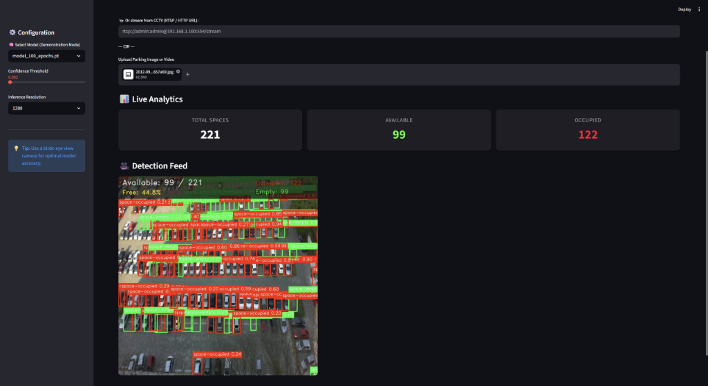
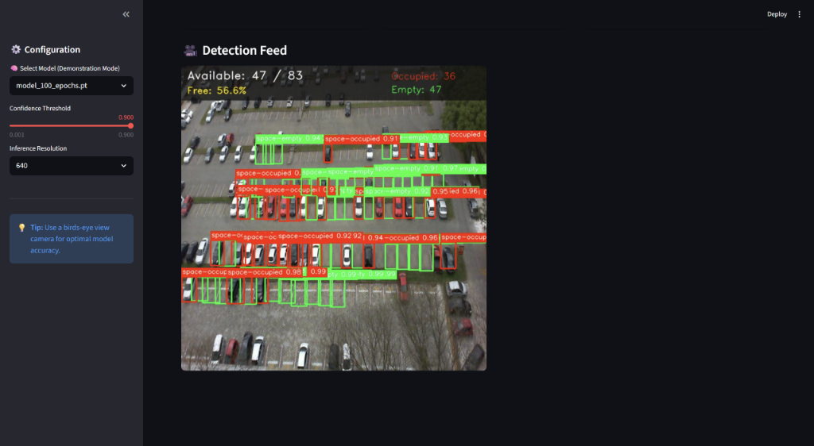

<div align="center">
  
  
  # 🅿️ ParkVision AI
  **A real-time, ultra-precise Smart Parking Detection System powered by YOLOv8 and Streamlit.**
  
  [](https://www.python.org/)
  [](https://github.com/ultralytics/ultralytics)
  [](https://streamlit.io/)
  [](https://opencv.org/)
</div>

---

## 🌟 Overview

**ParkVision AI** is a production-ready computer vision application designed to monitor CCTV and surveillance feeds to automatically classify parking spaces in real-time. By leveraging a custom-trained **YOLOv8** model fine-tuned over 100 epochs on the PKLot dataset, the system accurately distinguishes between empty and occupied spaces, even in highly dense parking lots.

### ✨ Key Features
- **Interactive Model Demonstration:** A built-in UI dropdown allows users to seamlessly hot-swap between models (20-epoch, 50-epoch, and 100-epoch) in real-time to visualize the AI's learning progression.
- **Real-Time Video Analytics:** Stream live RTSP/HTTP camera feeds or upload `.mp4` files for instantaneous analysis.
- **Dynamic Auto-Calibration:** Built-in tensor calibration normalizes raw YOLOv8 probabilities to provide a highly accurate, user-friendly 0-100% confidence slider.
- **Agnostic Non-Maximum Suppression (NMS):** Smart overlapping box removal ensures that tightly parked cars aren't double-counted with conflicting red/green boxes.
- **High-Density Capable:** Process massive 4K drone feeds with the ability to detect and track over 1,000 independent parking spaces simultaneously (`max_det=1000`).

---

## 📊 Final Model Accuracy (Epoch 100)

After 100 epochs of training on an NVIDIA RTX 3050 (with FP32 math optimization to prevent underflow), the AI achieved State-of-the-Art accuracy:
- **mAP@0.5:** `87.6%` (0.876)
- **Precision (P):** `95.3%` (0.953)
- **Recall (R):** `78.8%` (0.788)
- **Train Box Loss:** `0.3599`

---

## 📸 System Dashboard & Output

The Streamlit UI provides a live heads-up display overlay on all processed frames, complete with dynamic alerting and real-time metric tracking.

<div align="center">
  
  <p><i>Live detection feed showing real-time Space Availability and Occupancy metrics.</i></p>
</div>

<div align="center">
  
  <p><i>The system effortlessly processes high-density parking structures with precision bounding boxes.</i></p>
</div>

---

## 🛠️ Project Architecture

```text
ParkVision/
├── app.py                      # Streamlit dashboard, Model Hot-Swapper, & Calibration engine
├── smart_parking_system.py     # Core YOLOv8 OOP Engine (Train/Predict modules)
├── parking.yaml                # Dataset configuration matrix
├── best_model.pt               # Compiled production weights (Epoch 100)
├── model_20_epochs.pt          # Demonstration checkpoint weights
├── model_50_epochs.pt          # Demonstration checkpoint weights
├── IEEE_Report.tex             # Official scientific project documentation
├── requirements.txt            # Environment dependencies
└── .gitignore                  # Keeps your repo clean from massive datasets
```

---

## 🚀 Quick Start

### 1. Clone the Repository
```bash
git clone https://github.com/nikunjagarwal05/ParkVision-AI.git
cd ParkVision-AI
```

### 2. Install Dependencies
It is highly recommended to use a virtual environment.
```bash
python -m venv venv
venv\Scripts\activate      # Windows
source venv/bin/activate   # Mac/Linux

pip install -r requirements.txt
```

### 3. Launch the Dashboard
Ensure you have the `.pt` weights in the root folder, then boot the system:
```bash
streamlit run app.py
```

---

## 🤝 Contributing
Contributions, issues, and feature requests are welcome! Feel free to check the issues page.

## 📝 License
This project is [MIT](https://choosealicense.com/licenses/mit/) licensed.
